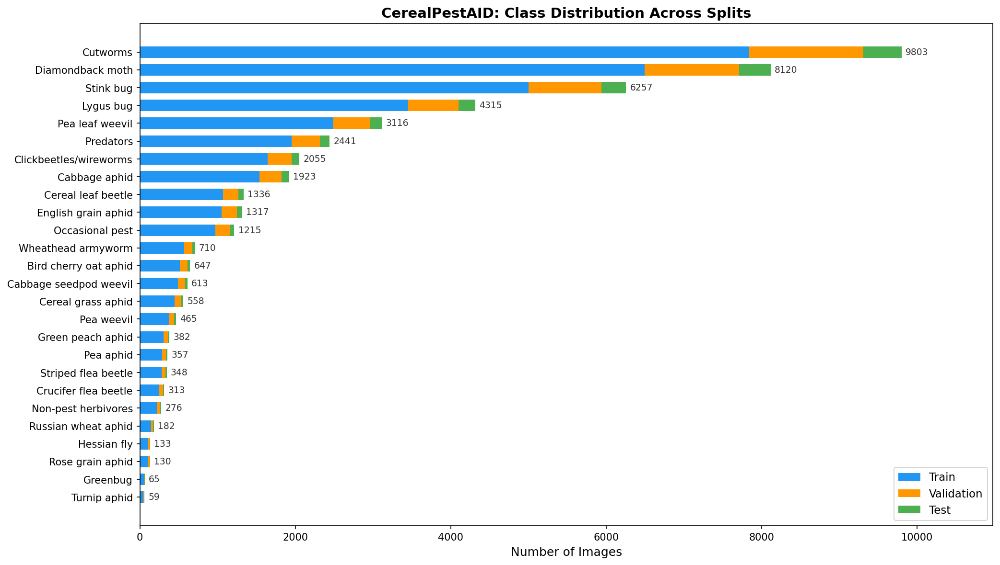
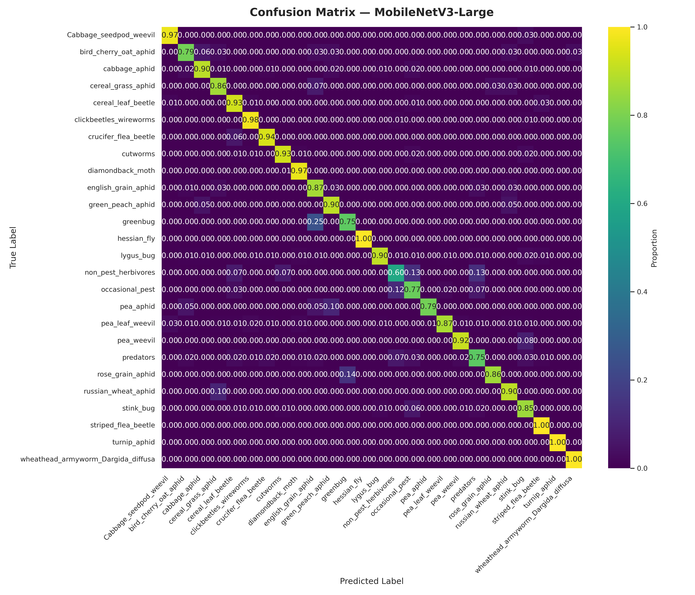
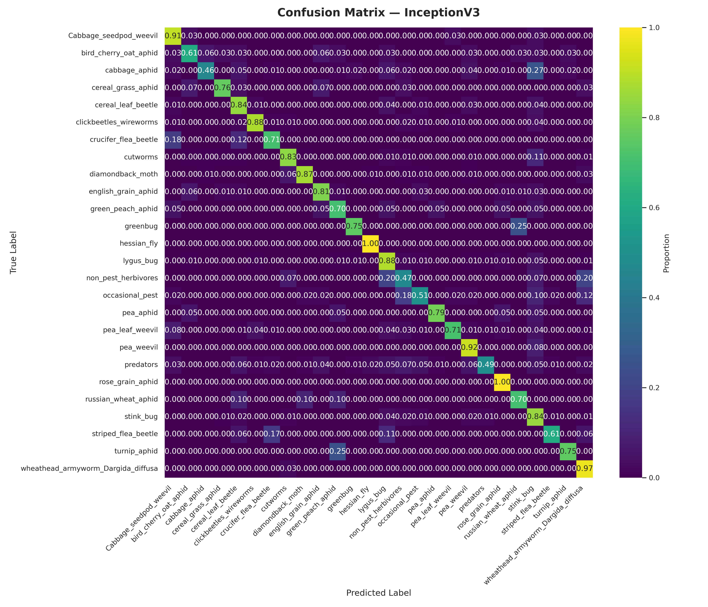
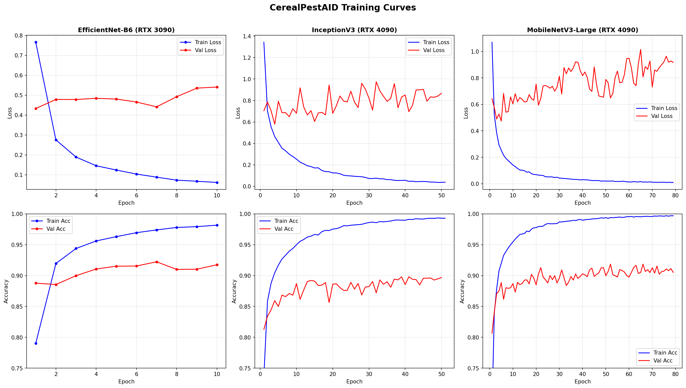

# CerealPestAID

Training and evaluation of deep learning models for cereal pest identification (26 species).

- **Project Website:** [cerealpestaid.net](https://cerealpestaid.net)
- **Models (HuggingFace):** [sheneman/CerealPestAID](https://huggingface.co/sheneman/CerealPestAID)
- **Dataset (HuggingFace):** [sheneman/CerealPestAID-dataset](https://huggingface.co/datasets/sheneman/CerealPestAID-dataset)

### Mobile App

[](https://apps.apple.com/us/app/identify-cereal-pests/id6737237141) [](https://play.google.com/store/apps/details?id=com.iids.rcds.cereal_pests_app_v2)

## Overview

CerealPestAID provides trained deep learning classifiers for identifying 26 species of cereal crop pests from images. Three model architectures are compared: **EfficientNet-B6**, **MobileNetV3-Large**, and **InceptionV3**. Pre-trained model weights are available in PyTorch, ONNX, and TFLite formats.

## Dataset

The dataset contains labeled images of 26 cereal pest species organized into train/val/test splits using `torchvision.datasets.ImageFolder` conventions (one subdirectory per class).

| Split | Images |
|-------|-------:|
| Train | 37,699 |
| Validation | 7,056 |
| Test | 2,381 |
| **Total** | **47,136** |

**26 Classes:**



| Index | Species | Train | Val | Test | Total |
|:-----:|---------|------:|----:|-----:|------:|
| 0 | Cabbage seedpod weevil | 490 | 91 | 32 | 613 |
| 1 | Bird cherry oat aphid | 517 | 97 | 33 | 647 |
| 2 | Cabbage aphid | 1,538 | 288 | 97 | 1,923 |
| 3 | Cereal grass aphid | 446 | 83 | 29 | 558 |
| 4 | Cereal leaf beetle | 1,068 | 200 | 68 | 1,336 |
| 5 | Clickbeetles / wireworms | 1,644 | 307 | 104 | 2,055 |
| 6 | Crucifer flea beetle | 250 | 46 | 17 | 313 |
| 7 | Cutworms | 7,842 | 1,470 | 491 | 9,803 |
| 8 | Diamondback moth | 6,496 | 1,218 | 406 | 8,120 |
| 9 | English grain aphid | 1,053 | 197 | 67 | 1,317 |
| 10 | Greenbug | 52 | 9 | 4 | 65 |
| 11 | Green peach aphid | 305 | 57 | 20 | 382 |
| 12 | Hessian fly | 106 | 19 | 8 | 133 |
| 13 | Lygus bug | 3,452 | 647 | 216 | 4,315 |
| 14 | Non-pest herbivores | 220 | 41 | 15 | 276 |
| 15 | Occasional pest | 972 | 182 | 61 | 1,215 |
| 16 | Pea aphid | 285 | 53 | 19 | 357 |
| 17 | Pea leaf weevil | 2,492 | 467 | 157 | 3,116 |
| 18 | Pea weevil | 372 | 69 | 24 | 465 |
| 19 | Predators | 1,952 | 366 | 123 | 2,441 |
| 20 | Rose grain aphid | 104 | 19 | 7 | 130 |
| 21 | Russian wheat aphid | 145 | 27 | 10 | 182 |
| 22 | Stink bug | 5,005 | 938 | 314 | 6,257 |
| 23 | Striped flea beetle | 278 | 52 | 18 | 348 |
| 24 | Turnip aphid | 47 | 8 | 4 | 59 |
| 25 | Wheathead armyworm (*Dargida diffusa*) | 568 | 105 | 37 | 710 |

The dataset is available on HuggingFace: [sheneman/CerealPestAID-dataset](https://huggingface.co/datasets/sheneman/CerealPestAID-dataset)

## Model Performance

Evaluated on the held-out test set (2,381 samples):

| Model | Test Accuracy | Parameters | Best Classes (100%) | Weakest Class |
|-------|:------------:|:----------:|:-------------------:|---------------|
| **EfficientNet-B6** | **92.94%** | ~43M | 7 classes | non_pest_herbivores (66.7%) |
| MobileNetV3-Large | 90.09% | ~5.4M | 3 classes | non_pest_herbivores (60.0%) |
| InceptionV3 | 79.00% | ~27M | 2 classes | cabbage_aphid (46.4%) |

### Confusion Matrices

| EfficientNet-B6 | MobileNetV3-Large | InceptionV3 |
|:---:|:---:|:---:|
|  |  |  |

## Training Details

All models were trained on the University of Idaho RCDS HPC cluster using SLURM with CUDA 11.8.

### Hardware and Training Runs

| Model | GPU | Epochs Completed | Wall Time | Best Checkpoint Epoch |
|-------|-----|:----------------:|:---------:|:---------------------:|
| EfficientNet-B6 | NVIDIA RTX 3090 (24 GB) | 10 | ~5h 47m | 1 |
| InceptionV3 | NVIDIA RTX 4090 (24 GB) | 51 | ~6h 02m | 4 |
| MobileNetV3-Large | NVIDIA RTX 4090 (24 GB) | 79 | ~6h 04m | 5 |

Best model checkpoints were saved based on minimum validation loss. All runs were terminated by the SLURM wall time limit; subsequent epochs showed increasing validation loss (overfitting), confirming early checkpoint selection was appropriate.

### Training Curves



### Hyperparameters

- **Optimizer:** Adam (lr=1e-4)
- **LR Schedule:** ReduceLROnPlateau (factor=0.9, patience=5)
- **Batch size:** 8
- **Max epochs:** 1000 (early stopping via best validation loss)
- **Loss:** CrossEntropyLoss
- **Class balancing:** WeightedRandomSampler (inverse class frequency)
- **Input resolution:** 528x528 (resize to 572, then crop)

### Data Augmentation (training)
- RandomResizedCrop (528, scale 0.6-1.0)
- RandomHorizontalFlip
- RandomVerticalFlip
- RandomRotation (30 degrees)
- ColorJitter (brightness=0.2, contrast=0.2, saturation=0.2, hue=0.2)
- ImageNet normalization (mean=[0.485, 0.456, 0.406], std=[0.229, 0.224, 0.225])

## Repository Structure

```
CerealPestAID/
├── README.md
├── LICENSE
├── requirements.txt
├── .gitignore
├── label_mappings.txt
├── training/
│   ├── train_efficientnet.py
│   ├── train_inceptionv3.py
│   └── train_mobilenetv3.py
├── evaluation/
│   ├── eval_efficientnet.py
│   ├── eval_inceptionv3.py
│   └── eval_mobilenetv3.py
├── conversion/
│   ├── efficientnet_to_onnx.py
│   ├── inceptionv3_to_onnx.py
│   ├── mobilenetv3_to_onnx.py
│   └── CONVERSION_GUIDE.md
├── inference/
│   ├── infer_tflite.py
│   └── heatmap.py
├── slurm/
│   ├── train_efficientnet.slurm
│   ├── train_inceptionv3.slurm
│   └── train_mobilenetv3.slurm
└── results/
    ├── confusion_matrix_efficientnet.png
    ├── confusion_matrix_inceptionv3.png
    └── confusion_matrix_mobilenetv3.png
```

## Getting Started

### Installation

```bash
git clone https://github.com/sheneman/CerealPestAID.git
cd CerealPestAID
pip install -r requirements.txt
```

### Download Models

Pre-trained weights are hosted on HuggingFace: [sheneman/CerealPestAID](https://huggingface.co/sheneman/CerealPestAID)

```bash
pip install huggingface-hub
huggingface-cli download sheneman/CerealPestAID --local-dir ./hf_models
```

### Training

Prepare your dataset in ImageFolder format under `./data/labels/{train,val,test}/` with one subdirectory per class, then:

```bash
python training/train_efficientnet.py
python training/train_inceptionv3.py
python training/train_mobilenetv3.py
```

Or submit via SLURM:

```bash
sbatch slurm/train_efficientnet.slurm
```

### Evaluation

```bash
python evaluation/eval_efficientnet.py --test-dir ./data/labels/test --checkpoint ./models/best_factai_efficientnet-b6.pth
python evaluation/eval_inceptionv3.py --test-dir ./data/labels/test --checkpoint ./models/best_factai_inceptionv3.pth
python evaluation/eval_mobilenetv3.py --test-dir ./data/labels/test --checkpoint ./models/best_factai_mobilenetv3.pth
```

### Inference (TFLite)

```bash
python inference/infer_tflite.py path/to/image.jpg
```

### Model Conversion

See [conversion/CONVERSION_GUIDE.md](conversion/CONVERSION_GUIDE.md) for details on converting PyTorch checkpoints to ONNX and TFLite.

## Model Formats

Each model is available in three formats:

| Format | Use Case | Files |
|--------|----------|-------|
| PyTorch (.pth) | Training, fine-tuning, GPU inference | `best_factai_*.pth` |
| ONNX (.onnx) | Cross-platform inference, optimization | `*_simplified.onnx` |
| TFLite (.tflite) | Mobile/edge deployment | `*_fp32.tflite` |

## Links

- **Project Website:** [cerealpestaid.net](https://cerealpestaid.net)
- **Models (HuggingFace):** [sheneman/CerealPestAID](https://huggingface.co/sheneman/CerealPestAID)
- **Dataset (HuggingFace):** [sheneman/CerealPestAID-dataset](https://huggingface.co/datasets/sheneman/CerealPestAID-dataset)

## Acknowledgments

This project, titled "Harnessing Artificial Intelligence for Implementing Integrated Pest Management in Small-Grain Production Systems," is funded under the U.S. Department of Agriculture No. 2021-67021-34253.

## Team

- **[Sanford Eigenbrode](https://www.uidaho.edu/cals/entomology-plant-pathology-and-nematology/our-people/sanford-eigenbrode)** - Distinguished Professor, Entomology, Plant Pathology, and Nematology, University of Idaho (PI)
- **[Arash Rashed](https://www.arec.vaes.vt.edu/arec/southern-piedmont/people/arash-rashed.html)** - Virginia Tech Southern Piedmont Agricultural Research and Extension Center
- **[Marek Borowiec](https://agsci.colostate.edu/directory/bio/?user=1189)** - Assistant Professor, Insect Systematist, Director of C. P. Gillette Museum, Colorado State University
- **[Subodh Adhikari](https://extension.usu.edu/directory/adhikari-subodh)** - Assistant Professor, Entomology Extension Specialist, Utah State University
- **[Luke Sheneman](https://hpc.uidaho.edu)** - Director of Research Computing, University of Idaho
- **[Jennifer Hinds](https://hpc.uidaho.edu)** - Research Applications Architect, University of Idaho
- **[John Brunsfeld](https://hpc.uidaho.edu)** - Senior Full Stack Developer, University of Idaho

## License

This project is licensed under the MIT License. See [LICENSE](LICENSE) for details.
